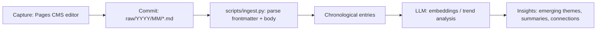

# vidya

**Vidya** (विद्या) is the Sanskrit word for *knowledge, learning, and true understanding*. This repository is a personal, plain-text knowledge log: a place to capture daily facts, news, and insights as Markdown files, edit them from anywhere via a CMS, and eventually mine them with an LLM to surface emerging trends and connections over time.

## Folder Structure

```
vidya/
├── .pages.yml               # Pages CMS configuration (schema for daily_logs collection)
├── .gitignore
├── README.md
├── raw/                      # Daily knowledge log entries (created as you write)
│   └── {year}/
│       └── {month}/
│           └── {year}-{month}-{day}.md
├── templates/
│   └── daily-template.md     # Frontmatter + section template for new entries
└── scripts/
    └── ingest.py              # Parses raw/ into a chronological feed for LLM ingestion
```

## Quickstart: Connecting to Pages CMS

1. Push this repository to GitHub (or GitLab).
2. Go to [app.pagescms.org](https://app.pagescms.org) and sign in.
3. Click **Add a new project** and select this repository.
4. Pages CMS will automatically detect the `.pages.yml` configuration at the repo root and expose the **Daily Logs** collection in its editor UI.
5. Create a new entry — Pages CMS will save it to `raw/{year}/{month}/{year}-{month}-{day}.md` with the `date`, `tags`, and `body` fields defined in the schema.
6. Edit entries from any device (desktop or mobile) through the Pages CMS web editor — changes are committed directly back to this Git repository.

## LLM Pipeline Workflow



1. **Capture** — Daily facts and insights are written as Markdown files (via Pages CMS or directly in Git) using the structure in [templates/daily-template.md](templates/daily-template.md).
2. **Ingest** — [scripts/ingest.py](scripts/ingest.py) walks `raw/`, extracts each file's YAML frontmatter (`date`, `tags`) and body, and orders entries chronologically.
3. **Process** — The ordered entries are handed off to an LLM pipeline (embeddings, clustering, summarization) to detect recurring themes and emerging trends across time.
4. **Discover** — Output is surfaced as trend reports, topic clusters, or summaries — turning scattered daily notes into longitudinal knowledge.
